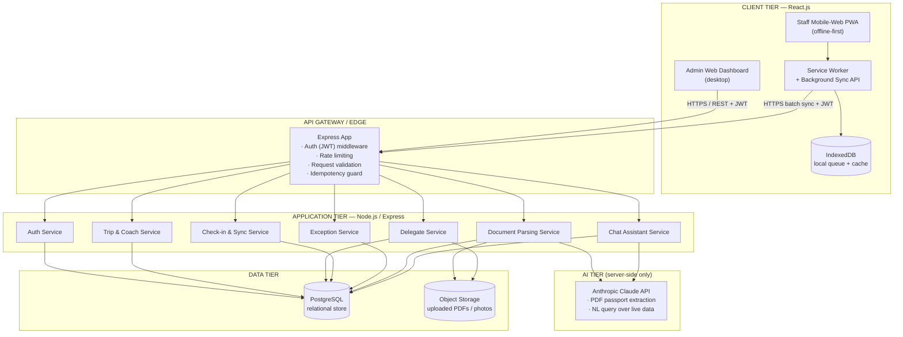

# MusterGo — High-Level Design (HLD)

**Project:** Real-Time Headcount with Multi-Staff Sync (SCCCI AI Challenge — Problem Statement #10)
**Team:** VJMDynamics (NYP × SCCCI) — Vance (Lead), Vimal, Desmond, Jun Qi, Jayden
**Tagline:** *No one gets left behind.*
**Document version:** 1.0 — QR-primary build (facial recognition deferred)

---

## 0. Scope & Critical Change Note

This build delivers an **offline-first attendance reconciliation platform** for SCCCI overseas
delegations (15–30 pax typical, 100+ pax peak) across multiple coaches and venues over
intermittent connectivity.

> **CHANGE (this phase):** The high-speed on-device **facial recognition** check-in feature has
> been **scratched/postponed**. **QR code scanning is the sole primary high-speed check-in
> method**, with **manual override** as the documented fallback. All architecture, schema, API,
> and code in this document reflect QR + Manual only. The schema retains a `photo_url` field on
> delegates purely for *visual identification on the missing-person list* (per the problem
> statement's "lists with photos" requirement) — it is **not** used for any biometric matching.

---

## 1. System Architecture

### 1.1 Overview

MusterGo is a three-tier system: a **React client** (admin web dashboard + mobile-web staff PWA),
a **Node.js / Express API tier**, and a **PostgreSQL** relational store. The defining constraint
is **intermittent connectivity on the ground**, so the client is built **offline-first**: every
check-in and exception is written to a local queue first and reconciled to the server via
**background sync** when roaming data is available. The AI tier (Anthropic Claude) is invoked
**server-side only** for two of Vance's features — passport/document parsing and the conversational
trip assistant — so the API key is never exposed to the client.

### 1.2 Architecture diagram



### 1.3 Client–server interaction

The admin dashboard is an online-biased SPA: it reads live aggregates (present / missing /
unassigned counts, coach status) and writes trip configuration. The staff PWA is the offline-first
surface used on coaches and at venues. Every staff action follows a **local-first write path**:

1. Staff scans a QR badge (or taps manual override).
2. The action is written **immediately** to IndexedDB with a client-generated `client_event_id`
   (UUID v4) and an optimistic UI update — the staff member sees "boarded" instantly, no spinner.
3. The Service Worker's Background Sync queue attempts to flush the event to
   `POST /api/checkins/sync` whenever connectivity returns.
4. The server treats `client_event_id` as an **idempotency key**: replays are ignored, so a
   flaky connection that retries the same batch can never double-count.

### 1.4 API gateway responsibilities

A single Express entry point acts as the gateway and applies, in order: TLS termination (via the
hosting platform), CORS, body parsing with size limits (10 MB to accommodate PDF uploads), request
schema validation, JWT authentication, role authorisation (`ADMIN` vs `STAFF`), per-route rate
limiting (stricter on the AI routes), and the **idempotency guard** that de-duplicates replayed
offline batches.

### 1.5 Offline-first sync logic

| Concern | Strategy |
|---|---|
| **Local store** | IndexedDB holds (a) the cached delegate manifest for the active trip and (b) an append-only `outbox` of pending check-ins and exception tickets. |
| **Queueing** | Each mutation gets a `client_event_id` (UUID) and `client_ts` (device clock) at creation time, before any network attempt. |
| **Flush trigger** | Background Sync API (`sync` event) + a foreground retry timer + a manual "Sync now" button. Batches up to 100 events per request. |
| **Idempotency** | Server upserts on `client_event_id` (unique constraint). A replayed batch returns the original result with `"duplicate": true`. |
| **Conflict resolution** | Check-ins are **monotonic** (a delegate becomes `PRESENT` and stays present), so conflicts are resolved by *first-write-wins on presence*. Coach reassignment uses **last-write-wins by `client_ts`**, with the server recording both events in the log for audit. |
| **Zero data loss** | The `outbox` row is deleted only after the server returns a 2xx acknowledgement for that specific `client_event_id`. A failed flush leaves the row queued. |
| **Offline indicator** | The client shows an "Offline — last synced HH:MM" banner driven by `navigator.onLine` + last successful flush timestamp, satisfying the problem statement's "offline mode" requirement. |

This directly targets the success metrics: reconcile 30 pax < 1 min / 100+ pax < 2 min (instant
local writes), zero data loss after sync (durable outbox + idempotency), and ≥ 4.5/5 usability
(optimistic UI, no blocking spinners on the ground).

---

## 2. Database Schema (PostgreSQL — Production-Ready DDL)

> Target: PostgreSQL 14+. Uses `uuid` primary keys, native `ENUM` types, `TIMESTAMPTZ`, soft
> deletes via `deleted_at`, and `updated_at` triggers. All foreign keys, uniqueness, and check
> constraints are declared explicitly.

```sql
-- ============================================================================
-- MusterGo — Schema DDL (QR-primary build, facial recognition deferred)
-- PostgreSQL 14+
-- ============================================================================

CREATE EXTENSION IF NOT EXISTS "pgcrypto";   -- for gen_random_uuid()

-- ---------------------------------------------------------------------------
-- ENUM TYPES
-- ---------------------------------------------------------------------------
CREATE TYPE user_role          AS ENUM ('ADMIN', 'STAFF');
CREATE TYPE trip_status        AS ENUM ('PLANNING', 'IN_PROGRESS', 'COMPLETED', 'CANCELLED');
CREATE TYPE delegate_status    AS ENUM ('EXPECTED', 'PRESENT', 'MISSING', 'UNASSIGNED');
CREATE TYPE document_status    AS ENUM ('UPLOADING', 'EXTRACTING', 'NEEDS_REVIEW', 'EXTRACTED', 'FAILED');
CREATE TYPE checkin_method     AS ENUM ('QR', 'MANUAL');   -- 'FACE' deferred this phase
CREATE TYPE exception_type     AS ENUM ('MISSING_PERSON', 'LOST_BADGE', 'DEAD_PHONE', 'VIP_REQUEST', 'OTHER');
CREATE TYPE exception_priority AS ENUM ('CRITICAL', 'NORMAL', 'LOW');
CREATE TYPE exception_status   AS ENUM ('OPEN', 'RESOLVED');
CREATE TYPE chat_role          AS ENUM ('USER', 'ASSISTANT');

-- ---------------------------------------------------------------------------
-- Shared updated_at trigger
-- ---------------------------------------------------------------------------
CREATE OR REPLACE FUNCTION set_updated_at()
RETURNS TRIGGER AS $$
BEGIN
    NEW.updated_at = now();
    RETURN NEW;
END;
$$ LANGUAGE plpgsql;

-- ===========================================================================
-- 1. USERS  (SCCCI secretariat & on-ground staff; shared feature)
-- ===========================================================================
CREATE TABLE users (
    id             UUID PRIMARY KEY DEFAULT gen_random_uuid(),
    staff_id       VARCHAR(64)  NOT NULL UNIQUE,
    password_hash  VARCHAR(255) NOT NULL,
    full_name      VARCHAR(160) NOT NULL,
    role           user_role    NOT NULL DEFAULT 'STAFF',
    workpass_id    VARCHAR(128) UNIQUE,                 -- nullable; "Sign in with Workpass"
    is_active      BOOLEAN      NOT NULL DEFAULT TRUE,
    created_at     TIMESTAMPTZ  NOT NULL DEFAULT now(),
    updated_at     TIMESTAMPTZ  NOT NULL DEFAULT now(),
    deleted_at     TIMESTAMPTZ                          -- soft delete
);
CREATE TRIGGER trg_users_updated BEFORE UPDATE ON users
    FOR EACH ROW EXECUTE FUNCTION set_updated_at();

-- ===========================================================================
-- 2. TRIPS  (overseas delegations)  — Desmond's domain
-- ===========================================================================
CREATE TABLE trips (
    id            UUID PRIMARY KEY DEFAULT gen_random_uuid(),
    name          VARCHAR(200) NOT NULL,                -- e.g. "Beijing study mission"
    destination   VARCHAR(200),
    start_date    DATE         NOT NULL,
    end_date      DATE         NOT NULL,
    status        trip_status  NOT NULL DEFAULT 'PLANNING',
    lead_user_id  UUID         REFERENCES users(id) ON DELETE SET NULL,
    created_at    TIMESTAMPTZ  NOT NULL DEFAULT now(),
    updated_at    TIMESTAMPTZ  NOT NULL DEFAULT now(),
    deleted_at    TIMESTAMPTZ,
    CONSTRAINT chk_trip_dates CHECK (end_date >= start_date)
);
CREATE TRIGGER trg_trips_updated BEFORE UPDATE ON trips
    FOR EACH ROW EXECUTE FUNCTION set_updated_at();
CREATE INDEX idx_trips_status ON trips(status) WHERE deleted_at IS NULL;

-- ===========================================================================
-- 3. COACHES  (buses / vehicles per trip)  — Desmond's domain
-- ===========================================================================
CREATE TABLE coaches (
    id           UUID PRIMARY KEY DEFAULT gen_random_uuid(),
    trip_id      UUID         NOT NULL REFERENCES trips(id) ON DELETE CASCADE,
    label        VARCHAR(80)  NOT NULL,                 -- e.g. "Coach 1"
    venue_label  VARCHAR(160),                          -- e.g. "Beijing"
    capacity     INTEGER      NOT NULL DEFAULT 40,
    sort_order   INTEGER      NOT NULL DEFAULT 0,
    created_at   TIMESTAMPTZ  NOT NULL DEFAULT now(),
    updated_at   TIMESTAMPTZ  NOT NULL DEFAULT now(),
    deleted_at   TIMESTAMPTZ,
    CONSTRAINT uq_coach_label UNIQUE (trip_id, label),
    CONSTRAINT chk_coach_capacity CHECK (capacity > 0)
);
CREATE TRIGGER trg_coaches_updated BEFORE UPDATE ON coaches
    FOR EACH ROW EXECUTE FUNCTION set_updated_at();
CREATE INDEX idx_coaches_trip ON coaches(trip_id) WHERE deleted_at IS NULL;

-- ===========================================================================
-- 4. DOCUMENTS  (uploaded passport PDFs)  — Vance's domain
-- ===========================================================================
CREATE TABLE documents (
    id               UUID PRIMARY KEY DEFAULT gen_random_uuid(),
    trip_id          UUID            REFERENCES trips(id) ON DELETE SET NULL,
    uploaded_by      UUID            NOT NULL REFERENCES users(id) ON DELETE RESTRICT,
    file_name        VARCHAR(255)    NOT NULL,
    file_url         TEXT            NOT NULL,           -- object-storage key
    status           document_status NOT NULL DEFAULT 'UPLOADING',
    total_count      INTEGER         NOT NULL DEFAULT 0, -- passports detected in file
    extracted_count  INTEGER         NOT NULL DEFAULT 0,
    error_message    TEXT,
    created_at       TIMESTAMPTZ     NOT NULL DEFAULT now(),
    updated_at       TIMESTAMPTZ     NOT NULL DEFAULT now(),
    CONSTRAINT chk_doc_counts CHECK (extracted_count <= total_count)
);
CREATE TRIGGER trg_documents_updated BEFORE UPDATE ON documents
    FOR EACH ROW EXECUTE FUNCTION set_updated_at();
CREATE INDEX idx_documents_trip ON documents(trip_id);

-- ===========================================================================
-- 5. DELEGATES  (participants / attendees)  — Vance (onboarding) + shared
-- ===========================================================================
CREATE TABLE delegates (
    id                  UUID PRIMARY KEY DEFAULT gen_random_uuid(),
    trip_id             UUID            NOT NULL REFERENCES trips(id) ON DELETE CASCADE,
    coach_id            UUID            REFERENCES coaches(id) ON DELETE SET NULL,  -- NULL = unassigned
    source_document_id  UUID            REFERENCES documents(id) ON DELETE SET NULL,
    full_name           VARCHAR(160)    NOT NULL,
    passport_number     VARCHAR(64),
    nationality         VARCHAR(80),
    passport_expiry     DATE,
    photo_url           TEXT,                            -- visual id only, NOT biometric
    is_vip              BOOLEAN         NOT NULL DEFAULT FALSE,
    status              delegate_status NOT NULL DEFAULT 'EXPECTED',
    parse_confidence    NUMERIC(4,3),                    -- 0.000–1.000 from AI extraction
    needs_review        BOOLEAN         NOT NULL DEFAULT FALSE,
    created_at          TIMESTAMPTZ     NOT NULL DEFAULT now(),
    updated_at          TIMESTAMPTZ     NOT NULL DEFAULT now(),
    deleted_at          TIMESTAMPTZ,
    CONSTRAINT uq_delegate_passport UNIQUE (trip_id, passport_number),
    CONSTRAINT chk_confidence CHECK (parse_confidence IS NULL
                                     OR (parse_confidence >= 0 AND parse_confidence <= 1))
);
CREATE TRIGGER trg_delegates_updated BEFORE UPDATE ON delegates
    FOR EACH ROW EXECUTE FUNCTION set_updated_at();
CREATE INDEX idx_delegates_trip   ON delegates(trip_id)  WHERE deleted_at IS NULL;
CREATE INDEX idx_delegates_coach  ON delegates(coach_id) WHERE deleted_at IS NULL;
CREATE INDEX idx_delegates_status ON delegates(trip_id, status) WHERE deleted_at IS NULL;

-- ===========================================================================
-- 6. CHECK_IN_LOGS  (attendance events)  — Vimal (QR) + Jayden (manual)
-- ===========================================================================
CREATE TABLE check_in_logs (
    id              UUID PRIMARY KEY DEFAULT gen_random_uuid(),
    delegate_id     UUID           NOT NULL REFERENCES delegates(id) ON DELETE CASCADE,
    trip_id         UUID           NOT NULL REFERENCES trips(id)     ON DELETE CASCADE,
    coach_id        UUID           REFERENCES coaches(id) ON DELETE SET NULL,
    method          checkin_method NOT NULL,             -- 'QR' or 'MANUAL'
    checked_in_by   UUID           NOT NULL REFERENCES users(id) ON DELETE RESTRICT,
    client_event_id UUID           NOT NULL UNIQUE,       -- idempotency key (offline sync)
    is_offline_origin BOOLEAN      NOT NULL DEFAULT FALSE,
    client_ts       TIMESTAMPTZ    NOT NULL,             -- device clock at scan time
    synced_at       TIMESTAMPTZ    NOT NULL DEFAULT now()-- server receive time
);
CREATE INDEX idx_checkins_delegate ON check_in_logs(delegate_id);
CREATE INDEX idx_checkins_trip     ON check_in_logs(trip_id);
CREATE INDEX idx_checkins_coach    ON check_in_logs(coach_id);

-- ===========================================================================
-- 7. EXCEPTION_TICKETS  (support tickets / on-site exceptions)  — Jayden
-- ===========================================================================
CREATE TABLE exception_tickets (
    id              UUID PRIMARY KEY DEFAULT gen_random_uuid(),
    trip_id         UUID               NOT NULL REFERENCES trips(id)      ON DELETE CASCADE,
    delegate_id     UUID               REFERENCES delegates(id) ON DELETE SET NULL,
    coach_id        UUID               REFERENCES coaches(id)   ON DELETE SET NULL,
    type            exception_type     NOT NULL,
    priority        exception_priority NOT NULL DEFAULT 'NORMAL',
    status          exception_status   NOT NULL DEFAULT 'OPEN',
    note            TEXT,
    raised_by       UUID               NOT NULL REFERENCES users(id) ON DELETE RESTRICT,
    resolved_by     UUID               REFERENCES users(id) ON DELETE SET NULL,
    client_event_id UUID               NOT NULL UNIQUE,   -- idempotency key (offline sync)
    is_offline_origin BOOLEAN          NOT NULL DEFAULT FALSE,
    created_at      TIMESTAMPTZ        NOT NULL DEFAULT now(),
    resolved_at     TIMESTAMPTZ,
    CONSTRAINT chk_resolved CHECK (
        (status = 'RESOLVED' AND resolved_at IS NOT NULL)
        OR (status = 'OPEN'  AND resolved_at IS NULL)
    )
);
CREATE INDEX idx_exceptions_trip   ON exception_tickets(trip_id, status);
CREATE INDEX idx_exceptions_pri    ON exception_tickets(trip_id, priority) WHERE status = 'OPEN';

-- ===========================================================================
-- 8. ITINERARY_ITEMS  (today's schedule shown on dashboard)  — Desmond
-- ===========================================================================
CREATE TABLE itinerary_items (
    id          UUID PRIMARY KEY DEFAULT gen_random_uuid(),
    trip_id     UUID        NOT NULL REFERENCES trips(id) ON DELETE CASCADE,
    day_number  INTEGER     NOT NULL,
    start_time  TIME        NOT NULL,
    title       VARCHAR(200) NOT NULL,
    location    VARCHAR(200),
    sort_order  INTEGER     NOT NULL DEFAULT 0,
    created_at  TIMESTAMPTZ NOT NULL DEFAULT now(),
    CONSTRAINT chk_day CHECK (day_number > 0)
);
CREATE INDEX idx_itinerary_trip ON itinerary_items(trip_id, day_number, sort_order);

-- ===========================================================================
-- 9. CHAT_SESSIONS + CHAT_MESSAGES  (trip assistant)  — Vance
-- ===========================================================================
CREATE TABLE chat_sessions (
    id          UUID PRIMARY KEY DEFAULT gen_random_uuid(),
    trip_id     UUID        REFERENCES trips(id) ON DELETE CASCADE,
    user_id     UUID        NOT NULL REFERENCES users(id) ON DELETE CASCADE,
    title       VARCHAR(200) NOT NULL DEFAULT 'New chat',
    created_at  TIMESTAMPTZ NOT NULL DEFAULT now(),
    updated_at  TIMESTAMPTZ NOT NULL DEFAULT now()
);
CREATE TRIGGER trg_chat_sessions_updated BEFORE UPDATE ON chat_sessions
    FOR EACH ROW EXECUTE FUNCTION set_updated_at();

CREATE TABLE chat_messages (
    id          UUID PRIMARY KEY DEFAULT gen_random_uuid(),
    session_id  UUID        NOT NULL REFERENCES chat_sessions(id) ON DELETE CASCADE,
    role        chat_role   NOT NULL,
    content     TEXT        NOT NULL,
    created_at  TIMESTAMPTZ NOT NULL DEFAULT now()
);
CREATE INDEX idx_chat_messages_session ON chat_messages(session_id, created_at);
```

### 2.1 Entity relationships (summary)

- A **trip** has many **coaches**, **delegates**, **documents**, **itinerary_items**, and **exception_tickets**.
- A **delegate** belongs to one **trip** and optionally one **coach** (`NULL` ⇒ unassigned); it
  may originate from a **document** (AI parse).
- A **check_in_log** records one attendance event for one **delegate**, attributed to a **user**;
  its `client_event_id` enforces offline idempotency.
- An **exception_ticket** may reference a **delegate** and **coach**, is raised by a **user**, and
  optionally resolved by another **user**.

---

## 3. RESTful API Endpoints

Base URL: `/api`. All non-auth routes require `Authorization: Bearer <JWT>`. Errors follow
`{ "error": { "code": "STRING", "message": "STRING" } }`.

### 3.1 Authentication

| Method | Route | Description | Request body | Response |
|---|---|---|---|---|
| `POST` | `/auth/login` | Staff ID + password sign-in | `{ "staffId": "staff_id_123", "password": "••••" }` | `{ "token": "eyJ...", "user": { "id": "u-1", "fullName": "Su Lin Wen", "role": "STAFF" } }` |
| `POST` | `/auth/workpass` | Singpass/Workpass exchange | `{ "authCode": "wp_abc123" }` | `{ "token": "eyJ...", "user": { "id": "u-2", "fullName": "Wei Ming Tan", "role": "ADMIN" } }` |
| `POST` | `/auth/refresh` | Rotate access token | `{ "refreshToken": "rt_..." }` | `{ "token": "eyJ..." }` |
| `POST` | `/auth/logout` | Invalidate refresh token | `{ "refreshToken": "rt_..." }` | `{ "ok": true }` |

### 3.2 Trips & Coaches (Desmond)

| Method | Route | Description | Request body | Response |
|---|---|---|---|---|
| `GET` | `/trips` | List trips | — | `{ "trips": [ { "id": "t-1", "name": "Beijing study mission", "status": "IN_PROGRESS", "startDate": "2026-08-12", "endDate": "2026-08-16", "delegateCount": 158 } ] }` |
| `POST` | `/trips` | Create trip | `{ "name": "Shanghai trade mission", "destination": "Shanghai", "startDate": "2026-08-28", "endDate": "2026-09-01", "leadUserId": "u-2" }` | `{ "id": "t-2", "status": "PLANNING" }` |
| `GET` | `/trips/:id` | Trip detail + itinerary | — | `{ "id": "t-1", "name": "Beijing study mission", "coaches": [ ... ], "itinerary": [ ... ] }` |
| `PUT` | `/trips/:id` | Update trip | `{ "status": "IN_PROGRESS" }` | `{ "id": "t-1", "status": "IN_PROGRESS" }` |
| `DELETE` | `/trips/:id` | Soft-delete trip | — | `{ "ok": true }` |
| `GET` | `/trips/:id/coaches` | List coaches for trip | — | `{ "coaches": [ { "id": "c-1", "label": "Coach 1", "capacity": 40, "boarded": 33, "missing": 7 } ] }` |
| `POST` | `/trips/:id/coaches` | Add coach | `{ "label": "Coach 4", "venueLabel": "Beijing", "capacity": 40 }` | `{ "id": "c-4", "label": "Coach 4" }` |
| `PUT` | `/coaches/:id` | Update coach | `{ "capacity": 45 }` | `{ "id": "c-1", "capacity": 45 }` |
| `DELETE` | `/coaches/:id` | Soft-delete coach | — | `{ "ok": true }` |

### 3.3 Delegates & Coach Reassignment (Vance onboarding, Desmond reassignment)

| Method | Route | Description | Request body | Response |
|---|---|---|---|---|
| `GET` | `/trips/:id/delegates` | List delegates (filter `?status=&coachId=`) | — | `{ "delegates": [ { "id": "d-1", "fullName": "Lim Wei Jie", "coachId": "c-2", "status": "MISSING", "isVip": true, "photoUrl": "..." } ] }` |
| `POST` | `/trips/:id/delegates` | Create one delegate | `{ "fullName": "Koh Siew Wah", "passportNumber": "S1112223C", "nationality": "Singapore", "passportExpiry": "2030-05-01" }` | `{ "id": "d-99", "status": "UNASSIGNED" }` |
| `POST` | `/trips/:id/delegates/bulk` | Bulk insert confirmed parse rows | `{ "delegates": [ { "fullName": "Lim Wei Jie", "passportNumber": "S1234567A", "nationality": "Singapore", "passportExpiry": "2029-08-12", "sourceDocumentId": "doc-1" } ] }` | `{ "inserted": 12, "skippedDuplicates": 0 }` |
| `PUT` | `/delegates/:id` | Update delegate | `{ "fullName": "Chen Hao Ming", "passportNumber": "E2233445C" }` | `{ "id": "d-2", "needsReview": false }` |
| `PATCH` | `/delegates/:id/coach` | Reassign coach (drag-drop) | `{ "coachId": "c-2", "clientEventId": "evt-uuid", "clientTs": "2026-08-14T14:21:00+08:00", "overrideCapacity": false }` | `{ "id": "d-2", "coachId": "c-2", "warning": null }` |
| `DELETE` | `/delegates/:id` | Soft-delete delegate | — | `{ "ok": true }` |

### 3.4 Document Parsing — AI (Vance)

| Method | Route | Description | Request body | Response |
|---|---|---|---|---|
| `POST` | `/documents` | Upload PDF (multipart) | `multipart/form-data: file=<pdf>, tripId=t-1` | `{ "id": "doc-2", "fileName": "delegates_batch_2.pdf", "status": "EXTRACTING", "totalCount": 12 }` |
| `GET` | `/documents/:id` | Poll parse status | — | `{ "id": "doc-2", "status": "NEEDS_REVIEW", "totalCount": 12, "extractedCount": 12 }` |
| `POST` | `/documents/:id/parse` | Trigger/replay Claude extraction | `{}` | `{ "rows": [ { "fullName": "Lim Wei Jie", "passportNumber": "S1234567A", "nationality": "Singapore", "passportExpiry": "2029-08-12", "confidence": 0.99 }, { "fullName": "Chen Hao Ming", "passportNumber": "E2233445C", "nationality": "China", "passportExpiry": null, "confidence": 0.62 } ] }` |
| `POST` | `/documents/:id/confirm` | Commit reviewed rows to delegates | `{ "tripId": "t-1", "rows": [ { "fullName": "Lim Wei Jie", "passportNumber": "S1234567A", "nationality": "Singapore", "passportExpiry": "2029-08-12" } ] }` | `{ "inserted": 12, "documentStatus": "EXTRACTED" }` |

### 3.5 Check-ins & Offline Sync (Vimal — QR, Jayden — manual)

| Method | Route | Description | Request body | Response |
|---|---|---|---|---|
| `POST` | `/checkins` | Single online QR/manual check-in | `{ "delegateId": "d-1", "coachId": "c-2", "method": "QR", "clientEventId": "evt-1", "clientTs": "2026-08-14T14:26:00+08:00" }` | `{ "id": "log-1", "delegateId": "d-1", "status": "PRESENT", "duplicate": false }` |
| `POST` | `/checkins/sync` | Batch flush of offline outbox | `{ "events": [ { "type": "CHECKIN", "delegateId": "d-1", "coachId": "c-2", "method": "QR", "clientEventId": "evt-1", "clientTs": "...", "isOfflineOrigin": true }, { "type": "EXCEPTION", "delegateId": "d-7", "exceptionType": "LOST_BADGE", "priority": "NORMAL", "clientEventId": "evt-2", "clientTs": "..." } ] }` | `{ "accepted": 2, "duplicates": 0, "results": [ { "clientEventId": "evt-1", "ok": true }, { "clientEventId": "evt-2", "ok": true } ] }` |
| `GET` | `/trips/:id/checkins` | Recent activity feed | — | `{ "activity": [ { "delegateName": "Tan S.L.", "coach": "Coach 2", "method": "QR", "at": "14:26" } ] }` |

### 3.6 Exceptions (Jayden)

| Method | Route | Description | Request body | Response |
|---|---|---|---|---|
| `GET` | `/trips/:id/exceptions` | List tickets (filter `?status=&priority=`) | — | `{ "tickets": [ { "id": "x-1", "type": "MISSING_PERSON", "priority": "CRITICAL", "status": "OPEN", "delegateName": "Lim Wei Jie", "coach": 2, "raisedBy": "Wei Ming", "createdAt": "14:18" } ], "counts": { "all": 8, "critical": 1, "open": 3, "resolved": 4 } }` |
| `POST` | `/trips/:id/exceptions` | Raise ticket | `{ "delegateId": "d-1", "coachId": "c-2", "type": "MISSING_PERSON", "priority": "CRITICAL", "note": "Phone unreachable. Last seen near gift shop at 14:08", "clientEventId": "evt-3", "clientTs": "..." }` | `{ "id": "x-9", "status": "OPEN", "pushedToDevices": 5 }` |
| `PATCH` | `/exceptions/:id` | Resolve / update | `{ "status": "RESOLVED" }` | `{ "id": "x-1", "status": "RESOLVED", "resolvedAt": "14:31" }` |

### 3.7 Dashboard & Analytics (Jun Qi)

| Method | Route | Description | Request body | Response |
|---|---|---|---|---|
| `GET` | `/trips/:id/dashboard` | Live KPI tiles + coach status | — | `{ "missing": 12, "present": 143, "unassigned": 3, "openExceptions": { "critical": 1, "normal": 2 }, "departureInSec": 290, "coaches": [ { "label": "Coach 1", "missing": 7 } ] }` |
| `GET` | `/trips/:id/missing` | Reverse-headcount missing list w/ photos | — | `{ "missing": [ { "id": "d-1", "fullName": "Lim Wei Jie", "photoUrl": "...", "lastSeen": "14:08", "isVip": true } ] }` |
| `GET` | `/trips/:id/export?format=xlsx` | Download attendance report | — | `200 OK` — `Content-Type: application/vnd.openxmlformats-officedocument.spreadsheetml.sheet` (binary) |

### 3.8 Trip Assistant — AI Chatbot (Vance)

| Method | Route | Description | Request body | Response |
|---|---|---|---|---|
| `GET` | `/chat/sessions?tripId=t-1` | List chat history | — | `{ "sessions": [ { "id": "s-1", "title": "Coach 2 missing list", "messageCount": 4, "updatedAt": "14:26" } ] }` |
| `POST` | `/chat/sessions` | Start new chat | `{ "tripId": "t-1" }` | `{ "id": "s-9", "title": "New chat" }` |
| `POST` | `/chat/sessions/:id/messages` | Send NL query; Claude answers over live data | `{ "content": "Who is missing from Coach 2?" }` | `{ "assistant": { "content": "5 delegates haven't boarded Coach 2 yet: Lim Wei Jie (VIP, last 14:08), Ng Soo Peng (phone unreachable), Tan Boon Heng, Wong Pei Shan, Goh Mei Ling.", "actions": [ { "label": "Send ping", "type": "PING" }, { "label": "Open Coach 2", "type": "NAV", "coachId": "c-2" } ] }, "sessionTitle": "Coach 2 missing list" }` |

---

## 4. Recommended Production Folder Structure

```text
VJMDynamics-NYP-x-SCCCI/
├── README.md
├── docker-compose.yml                 # postgres + api + web for local dev
├── .env.example
│
├── backend/                           # Node.js + Express + PostgreSQL
│   ├── package.json
│   ├── src/
│   │   ├── server.js                  # app bootstrap, listen
│   │   ├── app.js                     # express app, gateway middleware wiring
│   │   ├── config/
│   │   │   ├── env.js                 # typed env loader
│   │   │   └── db.js                  # pg pool
│   │   ├── middleware/
│   │   │   ├── auth.js                # JWT verify + role guard
│   │   │   ├── validate.js            # request schema validation
│   │   │   ├── idempotency.js         # client_event_id de-dup
│   │   │   ├── rateLimit.js
│   │   │   └── errorHandler.js
│   │   ├── modules/
│   │   │   ├── auth/                   # shared (team)
│   │   │   │   ├── auth.routes.js
│   │   │   │   ├── auth.controller.js
│   │   │   │   └── auth.service.js
│   │   │   ├── trips/                  # Desmond
│   │   │   ├── coaches/                # Desmond
│   │   │   ├── delegates/              # Vance (onboarding) + Desmond (reassign)
│   │   │   ├── documents/              # Vance — AI parsing
│   │   │   │   ├── documents.routes.js
│   │   │   │   ├── documents.controller.js
│   │   │   │   ├── documents.service.js
│   │   │   │   └── claudeParser.js     # Anthropic Claude SDK wrapper
│   │   │   ├── checkins/               # Vimal (QR) + sync engine
│   │   │   │   ├── checkins.routes.js
│   │   │   │   ├── checkins.controller.js
│   │   │   │   └── sync.service.js     # batch + idempotency
│   │   │   ├── exceptions/             # Jayden
│   │   │   ├── dashboard/              # Jun Qi
│   │   │   │   ├── dashboard.routes.js
│   │   │   │   └── export.service.js   # xlsx generation
│   │   │   └── chat/                   # Vance — AI assistant
│   │   │       ├── chat.routes.js
│   │   │       ├── chat.controller.js
│   │   │       └── claudeAssistant.js
│   │   ├── lib/
│   │   │   ├── anthropic.js            # single Claude client (1 shared seat)
│   │   │   ├── storage.js              # object-storage helper
│   │   │   └── logger.js
│   │   └── db/
│   │       ├── migrations/             # numbered SQL migrations
│   │       │   ├── 001_init.sql        # the DDL from §2
│   │       │   └── 002_seed_dev.sql
│   │       └── seed/
│   └── tests/
│
└── frontend/                          # React.js (Vite) — admin web + staff PWA
    ├── package.json
    ├── vite.config.js
    ├── index.html
    ├── public/
    │   ├── manifest.webmanifest        # PWA manifest
    │   └── service-worker.js           # offline cache + background sync
    └── src/
        ├── main.jsx
        ├── App.jsx                     # router + route guards
        ├── styles/
        │   └── tokens.css              # SCCCI Red + 5-state status palette
        ├── lib/
        │   ├── api.js                  # fetch wrapper w/ JWT
        │   ├── offlineQueue.js         # IndexedDB outbox
        │   └── claudeParse.js          # calls backend /documents/parse
        ├── components/
        │   ├── Layout.jsx
        │   ├── Sidebar.jsx
        │   ├── StatusBadge.jsx         # 5-state colour system
        │   └── OfflineBanner.jsx
        └── pages/
            ├── LoginPage.jsx           # shared (team) — Screen 1
            ├── OnboardingPage.jsx      # Vance — Screen 4 (FULL)
            ├── ChatAssistantPage.jsx   # Vance — Screen 6
            ├── DashboardPage.jsx       # Jun Qi — Screen 2 (scaffold)
            ├── TripCoachPage.jsx       # Desmond — Screen 3 (scaffold)
            ├── QRCheckInPage.jsx       # Vimal — mobile (scaffold)
            └── ExceptionInboxPage.jsx  # Jayden — Screen 5 (scaffold)
```

### 4.1 Why this structure

The backend is organised by **feature module**, not by technical layer, so each team member owns
one folder end-to-end (routes → controller → service) and merge conflicts on `main` are rare. The
single shared **Anthropic Claude client** (`lib/anthropic.js`) reflects the one-seat constraint
from the assignment brief. On the frontend, the offline machinery (`offlineQueue.js` +
`service-worker.js`) is isolated so the QR and Exception pages can both enqueue without duplicating
sync logic.

---

## 5. Security, Performance & Usability Notes

- **Security:** bcrypt password hashing, JWT with short-lived access + rotating refresh tokens,
  role-based route guards, parameterised SQL only (no string concatenation), file-type + size
  validation on uploads, and the Claude API key held server-side exclusively. Delegate passport
  data is PII — access is restricted to authenticated SCCCI staff and never returned to the client
  in bulk export without `ADMIN` role.
- **Performance:** the < 1 s / < 2 s reconciliation targets are met by optimistic local writes;
  indexed `delegates(trip_id, status)` keeps the missing-list query fast at 100+ pax; dashboard
  aggregates are computed with a single grouped query.
- **Usability (≥ 4.5/5):** no blocking spinners on the ground, an always-visible offline banner,
  drag-and-drop reassignment, and one-tap manual override when QR fails — every on-ground action
  is reachable in a single tap from the staff PWA.
