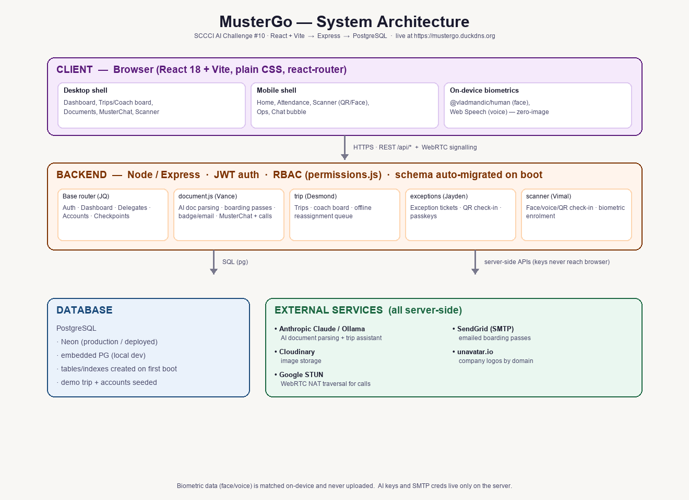
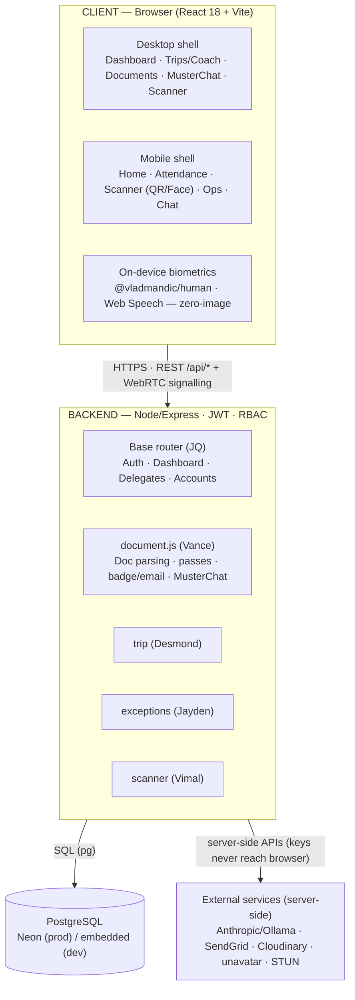

# MusterGo — System Architecture

Real-time headcount & attendance reconciliation for SCCCI overseas delegations
(SCCCI AI Challenge, Problem Statement #10). This document describes the overall
architecture, how the layers interact, the technology choices, and how to
navigate the codebase.

**Live app:** https://mustergo.duckdns.org



## Layers at a glance



## Frontend (`frontend/`)
- **React 18 + Vite**, plain CSS (no UI framework), `react-router-dom`.
- **Two shells sharing one backend and most `lib/` code:** a desktop sidebar
  layout and a mobile bottom-tab layout. Routing and role-gating live in
  `src/App.jsx` (`firstAllowedRoute` / permission checks).
- **Biometrics run on-device only** — `@vladmandic/human` for face, Web Speech
  for voice. Raw pixels/audio never leave the browser; only a derived match
  result is sent. (FaceCheck-Pro, Vimal.)
- Talks to the backend over `/api/*` (same-origin via the dev proxy / the
  deployed origin), plus WebRTC for MusterChat calls (offer/answer/ICE relayed
  through the backend, media peer-to-peer via Google STUN).

## Backend (`backend/`)
- **Express + `pg`** against PostgreSQL. One **base router** (JQ:
  Auth/Dashboard/Delegates/Accounts/Checkpoints) plus **one router per teammate
  feature**, all mounted in `backend/server.js`:
  - `routes/document.js` — Vance: AI document parsing, boarding passes,
    badge/email, MusterChat + calls.
  - trip routes — Desmond: trips, coach board, offline reassignment.
  - exception routes — Jayden: exception tickets, QR check-in, passkeys.
  - scanner routes — Vimal: face/voice/QR check-in, enrolment.
- **Auth:** signed JWT, single active session per account (token-version bump on
  login). **RBAC:** granular per-account permissions in `permissions.js`.
- **Schema is created automatically on first boot** (`ensureReady()` —
  idempotent `CREATE TABLE / ADD COLUMN IF NOT EXISTS`); a demo trip and
  accounts are seeded. **No manual migration step.**
- **AI is server-side only** — Anthropic Claude (or local Ollama fallback) for
  document parsing and the trip assistant — so no API key ever reaches the
  browser.

## Database
- **PostgreSQL** — Neon in production/deployment, an embedded local Postgres in
  development. Same schema either way (auto-migrated on boot).

## External services (all called server-side)
| Service | Purpose |
|---|---|
| Anthropic Claude / Ollama | AI document parsing + trip assistant |
| SendGrid (SMTP) | emailed boarding passes |
| Cloudinary | image storage |
| unavatar.io | company logos by website domain |
| Google STUN | WebRTC NAT traversal for calls |

## Deployment
Frontend + backend + PostgreSQL are deployed and served at
**https://mustergo.duckdns.org**. See [`README/DEPLOYMENT.md`](../README/DEPLOYMENT.md)
for the deploy process and required environment variables (`DATABASE_URL`,
`JWT_SECRET`, `FRONTEND_URL`, `SMTP_*`, Cloudinary keys, and — for cloud
parsing where there is no Ollama — `ANTHROPIC_API_KEY`). Secrets live only in
the server environment; the repo ships `.env.example` placeholders only.

## Navigating the project
```
frontend/src/         React app (desktop + mobile shells, shared lib/)
backend/routes/       one router per feature (mounted in server.js)
backend/db/           connection + schema/history helpers
docs/<student>/       individual A1 design docs (use-cases, API, DB schema)
docs/architecture.md  this file + architecture-diagram.png
tests/<student>/      individual unit tests
ai/<student>/         individual AI workflow logs + reflection
README/               project docs (deployment, structure, integration notes)
```
Full file-by-file breakdown: [`README/PROJECT_STRUCTURE.md`](../README/PROJECT_STRUCTURE.md).
Ownership & integration history: [`README/INTEGRATION_NOTES.md`](../README/INTEGRATION_NOTES.md).
