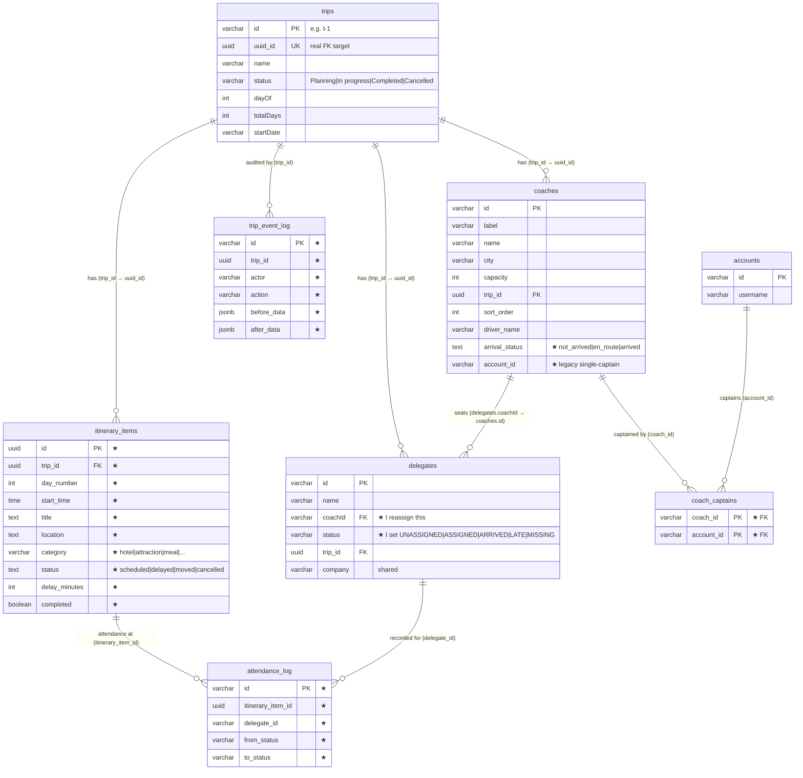

# Database Schema — Desmond (Trip Booking & Dynamic Coach Management)

Screen 3 (Trip Management & Coach Assignment). PostgreSQL, accessed with the `pg`
driver against the shared team database.

My feature owns the **itinerary** and **coach-captain / audit** tables, and adds
the fleet-operations columns to the shared `coaches` and `trips` tables. Delegate
identity is JQ's; I read and write a delegate's **coach and status** (the
reassignment), plus a few profile columns. My own DDL is created lazily and
idempotently in an `ensureOpsSchema()` IIFE in `backend/routes/trip.js`
(`CREATE TABLE / ADD COLUMN IF NOT EXISTS`), so it is safe on every startup.

★ = added or owned by my feature.

## Entity-relationship diagram

## Tables I own

### `itinerary_items` — the day-by-day schedule
Base table created in `db/schema.js`; the live-status columns (`status`,
`delay_minutes`, `completed`) are added by my `trip.js` migration.

| Column | Type | Constraints / meaning |
| --- | --- | --- |
| `id` | `UUID` | PRIMARY KEY, default `gen_random_uuid()` |
| `trip_id` | `UUID` | NOT NULL, FK → `trips(uuid_id)` **ON DELETE CASCADE** |
| `day_number` | `INT` | NOT NULL — which day of the trip |
| `start_time` | `TIME` | NOT NULL — stored 24h; displayed as 12h |
| `title` | `TEXT` | NOT NULL |
| `location` | `TEXT` | optional venue |
| `sort_order` | `INT` | NOT NULL default 0 |
| `category` | `VARCHAR(24)` | NOT NULL default `'other'`, **CHECK** ∈ hotel/attraction/meal/factory/airport/transport/other |
| `status` ★ | `TEXT` | NOT NULL default `'scheduled'` — `scheduled\|delayed\|moved\|cancelled` |
| `delay_minutes` ★ | `INTEGER` | NOT NULL default 0 |
| `completed` ★ | `BOOLEAN` | NOT NULL default `false` |

Index: `idx_itinerary_trip ON itinerary_items(trip_id, day_number, sort_order)` —
loads a trip's schedule in day/time order.

### `coach_captains` — who captains which coach (many-to-many)
Replaces the old single `coaches.account_id`. Drives the coach-scoped view.

| Column | Type | Constraints |
| --- | --- | --- |
| `coach_id` | `VARCHAR(64)` | NOT NULL, FK → `coaches(id)` **ON DELETE CASCADE** |
| `account_id` | `VARCHAR(64)` | NOT NULL, FK → `accounts(id)` **ON DELETE CASCADE** |
|  |  | **PRIMARY KEY (coach_id, account_id)** |

Index: `idx_coach_captains_account ON coach_captains(account_id)` — "which coaches
does this account captain?" (scopes the board + Trips list).

### `trip_event_log` — persisted before→after audit
The change history for this feature's own mutations (reassign, coach/itinerary/
trip edits). Best-effort: an audit failure never blocks the real mutation.

| Column | Type | Meaning |
| --- | --- | --- |
| `id` | `VARCHAR(64)` PK | |
| `trip_id` | `UUID` | which trip |
| `actor` | `TEXT` | who made the change |
| `action` | `TEXT` | e.g. `delegate.reassign`, `coach.capacity` |
| `entity` / `entity_id` | `TEXT` / `VARCHAR(64)` | what changed |
| `summary` | `TEXT` | human-readable line ("moved from C1 to C2") |
| `before_data` / `after_data` | `JSONB` | value snapshots for the diff view |
| `at` | `TIMESTAMPTZ` | default `now()` |

Index: `trip_event_log_trip_at ON trip_event_log(trip_id, at DESC)` — newest-first.

### `attendance_log` — per-stop attendance change history
One row per change to a delegate's status **at a specific itinerary stop**, per
coach. The live per-stop status lives in JQ's `checkpoint_checkins` (which I also
upsert); this is the change log on top of it.

| Column | Type | Meaning |
| --- | --- | --- |
| `id` | `VARCHAR(64)` PK | |
| `trip_id` | `UUID` | |
| `itinerary_item_id` | `UUID` | which stop |
| `delegate_id` | `VARCHAR(64)` | who |
| `coach_id` | `VARCHAR(64)` | their coach at the time |
| `actor` | `TEXT` | who recorded it |
| `from_status` / `to_status` | `TEXT` | `ARRIVED` / `LATE` / `MISSING` |
| `at` | `TIMESTAMPTZ` | default `now()` |

Index: `attendance_log_item_at ON attendance_log(itinerary_item_id, at DESC)`.

## Columns I add to shared tables

### `coaches` (base: `id`, `label`, `name`, `city`, `capacity`)
| Column | Type | Notes |
| --- | --- | --- |
| `trip_id` | `UUID` | FK → `trips(uuid_id)` — which trip the coach is on. |
| `sort_order` | `INT` | column order on the board. |
| `driver_name` | `VARCHAR(255)` | the coach's driver. |
| `arrival_status` ★ | `TEXT` | NOT NULL default `'not_arrived'` — `not_arrived\|en_route\|arrived`. |
| `account_id` ★ | `VARCHAR(64)` | **legacy** single-captain, superseded by `coach_captains` (kept for seed/back-compat only). |

### `trips` (JQ's base + shared fleet fields I read/write)
| Column | Type | Notes |
| --- | --- | --- |
| `uuid_id` | `UUID` UNIQUE | the real FK target every trip-scoped table references. |
| `status` | `VARCHAR` | I drive the life-cycle: `Planning → In progress → Completed / Cancelled`. |
| `dayOf` / `totalDays` | `INT` | current day / total — derived from the itinerary. |
| `dateRange` | `VARCHAR` | display range, derived from `startDate` + `totalDays`. |
| `startDate` | `VARCHAR(10)` | ISO start date. |
| `itineraryBufferMinutes` | `INT` | min gap between two stops on a day (default 30). |

> **Trip-id gotcha:** `trips` has both a string `id` (`t-1`) and a `uuid_id`.
> All FKs (`coaches.trip_id`, `delegates.trip_id`, `itinerary_items.trip_id`,
> `trip_event_log.trip_id`) reference `uuid_id`. The client sends either the
> `uuid_id` (from `GET /api/all-trips`) or the legacy `t-1`; `resolveTripUuid()`
> accepts both — see [api-documentation.md](api-documentation.md).

### `delegates` (identity owned by JQ/Vance)
I **reassign** delegates and set a few profile fields; I do not own the table.

| Column | Type | My use |
| --- | --- | --- |
| `coachId` | `VARCHAR(64)` | FK → `coaches.id`. **I set this** on reassignment. |
| `status` | `VARCHAR(32)` | **I set this** — `UNASSIGNED\|ASSIGNED\|ARRIVED\|LATE\|MISSING`. |
| `trip_id` | `UUID` | FK → `trips.uuid_id`. |
| `company`, `accessibility_notes`, `notes`, `vip`, `name` | — | editable via `PATCH /api/delegates/:id/details`. |

## Tables I read but do not own

| Table | Owner | Used for |
| --- | --- | --- |
| `accounts` | JQ | coach captains, and the `actor` on audit rows. |
| `users` | JQ | staff directory (`GET /api/users/staff`); `coaches.staff_user_id`. |
| `checkpoint_checkins` | JQ / checkpoints | I upsert per-stop attendance here so the Dashboard/Timeline stay in sync. |
| `activity_log` | JQ | a reassignment is also logged here (via `logActivity`) so it shows in the app-wide History Log. |
