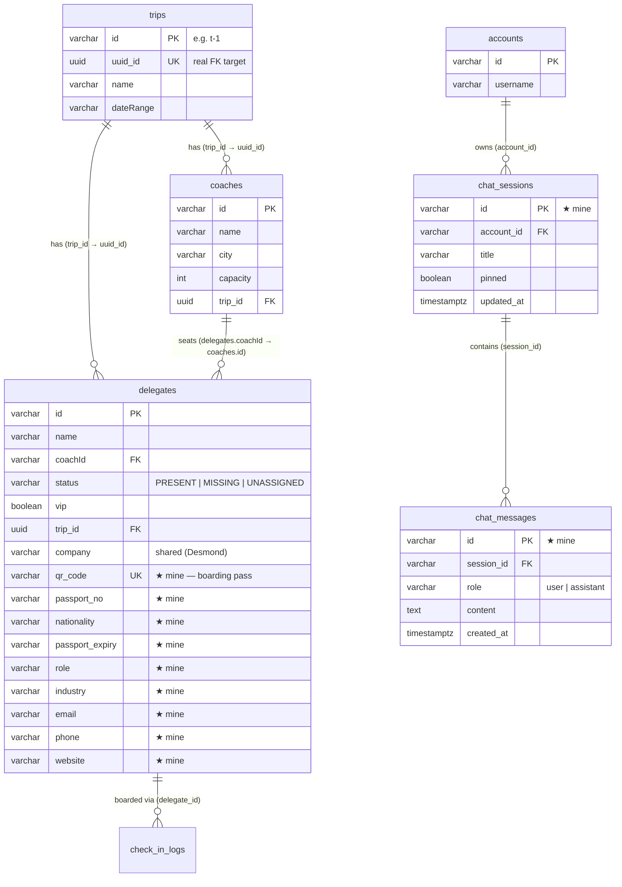

# Database Schema — Vance (Document Parsing + Trip Assistant)

Screens 4 (Document Parsing / Onboarding) and 6 (Trip Assistant). PostgreSQL,
accessed with the `pg` driver against the shared team Neon database.

My feature is **additive**: it adds columns to the shared `delegates` table and
owns the assistant tables (`chat_sessions`, `chat_messages`) and the MusterChat
tables (`dm_messages`, `call_signals`, `chat_groups`, `chat_group_members`). It
never alters the base tables owned by teammates — those are shown here only to make the relationships
clear. All my DDL is created lazily and idempotently by `ensureReady()` in
`backend/routes/vance.js` (`ADD COLUMN IF NOT EXISTS` / `CREATE TABLE IF NOT
EXISTS`), so it is safe to run on every startup.

## Entity-relationship diagram

★ = added or owned by my feature.

## Columns I add to the shared `delegates` table

Captured by the document parser and written on **Confirm**. `company` already
existed (Desmond) and is reused via `COALESCE`.

| Column | Type | Notes |
| --- | --- | --- |
| `passport_no` | `VARCHAR(64)` | From passport/ID documents (vision path). |
| `nationality` | `VARCHAR(128)` | From passport/ID documents. |
| `passport_expiry` | `VARCHAR(32)` | ISO date if legible, else null. Validated by `checkPassportExpiry` — flagged if expired or expiring within 6 months. |
| `role` | `VARCHAR(191)` | Job title / designation. |
| `industry` | `VARCHAR(191)` | Industry / sector. |
| `email` | `VARCHAR(191)` | |
| `phone` | `VARCHAR(64)` | |
| `website` | `VARCHAR(255)` | |
| `qr_code` | `VARCHAR(64)` | Unique boarding-pass token (e.g. `MG-86B620A4`), encoded into the delegate's QR badge. |

**Index:** `CREATE UNIQUE INDEX idx_delegates_qr ON delegates(qr_code) WHERE
qr_code IS NOT NULL` — guarantees no two delegates share a badge, while allowing
many delegates to have no code yet (partial unique index).

### Relevant base `delegates` columns (owned by JQ / Desmond)

| Column | Type | Relationship / meaning |
| --- | --- | --- |
| `id` | `VARCHAR(64)` PK | Delegate id. |
| `name` | `VARCHAR(255)` | Display name. |
| `coachId` | `VARCHAR(64)` | FK → `coaches.id`. Which coach the delegate is on. |
| `status` | `VARCHAR(32)` | `PRESENT` (checked in), `MISSING` (expected, on a coach, not checked in), `UNASSIGNED` (no coach yet). |
| `vip` | `BOOLEAN` | VIP flag (set in onboarding). |
| `trip_id` | `UUID` | FK → `trips.uuid_id`. Which trip the delegate belongs to. |
| `company` | `VARCHAR(255)` | Shared column (Desmond); my parser fills it. |

> **Trip id gotcha:** `trips` has both a string `id` (`t-1`) and a `uuid_id`.
> All FKs (`delegates.trip_id`, `coaches.trip_id`) reference `uuid_id`, but the
> client sends the value returned by `GET /api/all-trips` (which is the
> `uuid_id`) or the legacy `t-1` string. My `resolveTripUuid()` accepts **either**
> and maps to the `uuid_id` — see [api-documentation.md](api-documentation.md).

## Tables I own

### `chat_sessions` — saved assistant conversations (desktop sidebar)

| Column | Type | Constraints |
| --- | --- | --- |
| `id` | `VARCHAR(64)` | PRIMARY KEY |
| `account_id` | `VARCHAR(64)` | NOT NULL, FK → `accounts(id)` **ON DELETE CASCADE** |
| `title` | `VARCHAR(255)` | NOT NULL, default `'New chat'` (auto-set from first question) |
| `created_at` | `TIMESTAMPTZ` | NOT NULL, default `now()` |
| `updated_at` | `TIMESTAMPTZ` | NOT NULL, default `now()` (bumped on each message) |
| `pinned` | `BOOLEAN` | NOT NULL, default `false` |

Index: `idx_chat_sessions_acct ON chat_sessions(account_id, updated_at DESC)` —
lists a user's chats newest-first.

### `chat_messages` — individual turns within a session

| Column | Type | Constraints |
| --- | --- | --- |
| `id` | `VARCHAR(64)` | PRIMARY KEY |
| `session_id` | `VARCHAR(64)` | NOT NULL, FK → `chat_sessions(id)` **ON DELETE CASCADE** |
| `role` | `VARCHAR(16)` | NOT NULL — `'user'` or `'assistant'` |
| `content` | `TEXT` | NOT NULL |
| `created_at` | `TIMESTAMPTZ` | NOT NULL, default `now()` |

Index: `idx_chat_messages_sess ON chat_messages(session_id, created_at)` — loads
a conversation in order. Deleting a session cascades to its messages; deleting an
account cascades to its sessions and their messages.

## MusterChat tables (messaging, calls, groups)

### `dm_messages` — every MusterChat message (1:1 **and** group)

| Column | Type | Notes |
| --- | --- | --- |
| `id` | `VARCHAR(64)` PK | |
| `convo_key` | `VARCHAR(200)` | Order-independent pairing: 1:1 = `a:<x>|a:<y>` (sorted) or `a:<acct>|d:<delegate>`; group = `g:<groupId>`. Unit-tested in `messaging.test.js`. |
| `sender_id` | `VARCHAR(64)` | FK → `accounts(id)` **ON DELETE CASCADE** |
| `recipient_kind` | `VARCHAR(16)` | `account` \| `delegate` \| `group` |
| `recipient_id` | `VARCHAR(64)` | peer account/delegate id, or the group id |
| `kind` | `VARCHAR(16)` | `text` \| `sticker` \| `video` \| `doc` \| `call` |
| `body` | `TEXT` | text / caption / emoji sticker / call summary |
| `media` | `TEXT` | data URL (video / image sticker) or JSON (doc share) |
| `created_at` | `TIMESTAMPTZ` | default `now()` |
| `read_at` | `TIMESTAMPTZ` | set when the recipient opens the thread |
| `edited_at` | `TIMESTAMPTZ` | ★ set on edit (surfaces an "edited" tag) |
| `deleted_at` | `TIMESTAMPTZ` | ★ soft-delete; `body`/`media` are blanked so content is truly gone |

Indexes: `idx_dm_convo(convo_key, created_at)`, `idx_dm_inbox(recipient_kind,
recipient_id, read_at)`, `idx_dm_sender(sender_id, created_at)`.

### `call_signals` — WebRTC signaling relay (short-lived)

Two staff exchange offer/answer/ICE (and group `ginvite`/`gjoin`/`gpresence`/
`gleave`) through polled rows, so a real peer-to-peer call connects with just a
public STUN server. `id` PK, `call_id` (the room), `from_id`, `from_name`, `to_id`,
`kind` `VARCHAR(16)`, `payload` `TEXT` (JSON), `mode` `VARCHAR(8)`, `created_at`.
Rows are opportunistically deleted after 5 minutes. Index: `idx_call_signals_to(to_id, created_at)`.

### `chat_groups` / `chat_group_members` — group chats

`chat_groups`: `id` PK, `name`, `created_by` FK → `accounts(id)` CASCADE, `created_at`.
`chat_group_members`: `group_id` FK → `chat_groups(id)` CASCADE, `account_id` FK →
`accounts(id)` CASCADE, PRIMARY KEY `(group_id, account_id)`; index `idx_group_members_acct`.
A group's messages live in `dm_messages` (`convo_key = 'g:<id>'`) — no separate
message table, so media/kind/edit/delete are shared with 1:1.

## Tables I read but do not own

The Trip Assistant assembles a read-only snapshot from teammates' data. Every
read is `try/catch`-isolated so a missing table never breaks the chat.

| Table | Owner | Used for |
| --- | --- | --- |
| `check_in_logs` | Jayden | QR check-in records; also written by my `/checkin` endpoint. |
| `exception_tickets` | Jayden | Open exceptions in the assistant snapshot. |
| `itinerary_items` | Desmond | Today's itinerary in the assistant snapshot. |
| `coaches`, `trips`, `accounts` | JQ / Desmond | Coach counts, trip scoping, chat ownership. |
