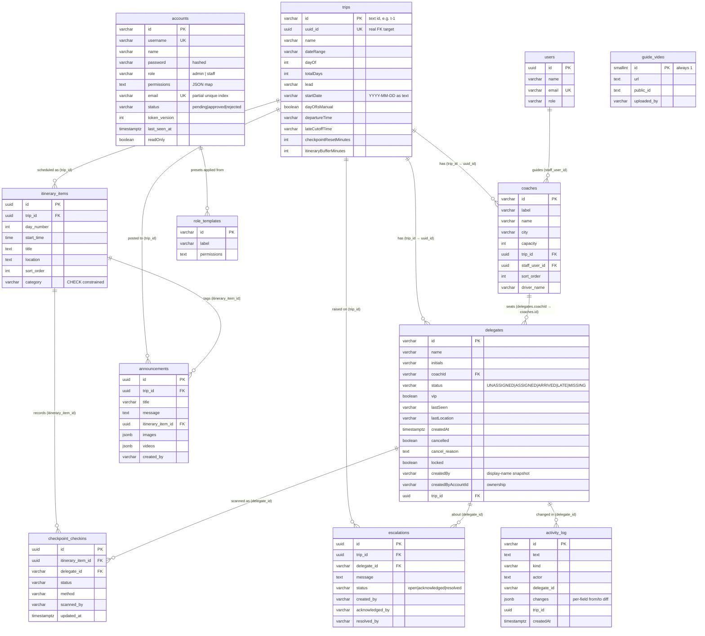

# Database Schema — JQ (InsightMetrics)

The MusterGo base schema. PostgreSQL, accessed with the `pg` driver through
`backend/db/connection.js`.

I own `backend/db/schema.js`, which creates **every base table** and is the
foundation the rest of the team builds on. Teammates add their own tables in
their own modules and never edit this file — the arrangement that keeps five
people out of each other's migrations.

Everything is created idempotently (`CREATE TABLE IF NOT EXISTS` /
`ADD COLUMN IF NOT EXISTS` / `CREATE INDEX IF NOT EXISTS`) and re-runs harmlessly
on every server start, so a fresh database is set up automatically and nobody
provisions anything by hand.

## Postgres conventions used throughout
- Every mixed-case column name is **double-quoted**, because unquoted
  identifiers are lower-cased and these columns are camelCase. `lead` and
  `localTime` also need quoting as reserved words.
- Dates that must not shift by reader timezone (`startDate`, `departureTime`,
  `lateCutoffTime`) are stored as **plain text**, not `DATE`/`TIME`: the driver's
  `DATE` parser returns a JS `Date` at UTC midnight, which moves a day across
  timezones. Arithmetic casts to `::date` / `::time` inline at the point of use.
- Two id systems coexist deliberately: the original text ids (`t-1`, `c1`,
  `d-118`) that the base app and every UI still use, and a parallel `uuid_id` on
  trips that newer FK columns reference. Changing the text ids would have broken
  every existing route.

## Entity-relationship diagram

---

## Core tables

### `trips`
The trip being run. `id` stays a text id (`t-1`) because every existing route
and UI uses it; `uuid_id` was added as a parallel identity so newer tables can
hold real UUID foreign keys without breaking any of that.

| Column | Type | Notes |
| --- | --- | --- |
| `id` | `VARCHAR(64)` PK | Text id. |
| `uuid_id` | `UUID` UNIQUE | The actual FK target for every newer table. |
| `name`, `"dateRange"`, `"lead"`, `status` | text | Trip meta. |
| `"dayOf"`, `"totalDays"` | `INT` | Current day / length. `dayOf` is recomputed every 60s from `startDate`. |
| `"dayOfIsManual"` | `BOOLEAN` | Set when staff hand-edit the current day, so the auto-sync tick doesn't overwrite a deliberate override. |
| `"startDate"` | `VARCHAR(10)` | `YYYY-MM-DD` as text — see the timezone note above. |
| `"departureTime"` | `VARCHAR(8)` | Time-of-day on the last day; combined with `startDate` + `totalDays` into the live countdown. |
| `"lateCutoffTime"` | `VARCHAR(8)` | Per-trip Late policy, default `10:00` — the value this was previously hardcoded to, so untouched trips don't change behaviour. |
| `"checkpointResetMinutes"` | `INT` | Minutes before the next stop that an arrived delegate resets for re-scanning. |
| `"itineraryBufferMinutes"` | `INT` | Minimum gap between two same-day stops. **Deliberately decoupled** from the reset window (they once shared a value): shrinking the reset window for testing must not shrink the itinerary gap. |
| `"countryFrom"`, `"countryTo"` | `VARCHAR(80)` | Per-trip rather than hardcoded — assuming Singapore would be silently wrong the day a trip isn't. |

### `delegates`
The shared roster — the single most-read table in the app, and the one every
teammate's module writes through my helpers rather than with its own SQL.

| Column | Type | Notes |
| --- | --- | --- |
| `id` | `VARCHAR(64)` PK | Text id. |
| `name`, `initials` | text | Display. |
| `"coachId"` | `VARCHAR(64)` | Seat assignment → `coaches.id`. |
| `status` | `VARCHAR(32)` | Exactly five values: `UNASSIGNED`, `ASSIGNED`, `ARRIVED`, `LATE`, `MISSING`. |
| `vip` | `BOOLEAN` | Priority handling. |
| `"lastSeen"` | `VARCHAR(255)` | A time/note ("Lobby · 14:02"). |
| `"lastLocation"` | `VARCHAR(255)` | A staff-entered place — deliberately distinct from `lastSeen`, which isn't lookup-able. |
| `"createdAt"` | `TIMESTAMPTZ` | `NOT NULL DEFAULT now()` so existing rows get the migration time and new rows their insert time. |
| `cancelled` | `BOOLEAN` | See below. |
| `cancel_reason` | `TEXT` | Cleared when `cancelled` flips back to false, so it can't linger as stale context for a later, unrelated cancellation. |
| `locked` | `BOOLEAN` | Blocks **everyone including the creator** — a finalize step, not just a shield against other staff. |
| `"createdBy"` | `VARCHAR(255)` | A display-name **snapshot**, not a live FK, so it stays correct if the account is renamed or deleted. |
| `"createdByAccountId"` | `VARCHAR(64)` | The account id, which ownership enforcement actually needs. Separate from `createdBy` on purpose. No FK — `accounts` isn't created until later in the same script, so one would fail on a fresh database. `NULL` = no owner recorded, keeping legacy rows editable instead of retroactively locking everyone out. |
| `"photoUrl"`, `"photoPublicId"` | `TEXT` | Cloudinary asset + its id, needed to destroy the old image on replace or it is orphaned forever. |
| `trip_id` | `UUID` FK | → `trips.uuid_id`. |
| `notes`, `company`, `accessibility_notes`, `hotel_name`, `room_number` | text | Board and rooming fields (shared with Desmond's module). |

**Why `cancelled` is a flag and not a sixth status:** the five-status set is
duplicated across roughly five subsystems (badges, KPIs, coach capacity,
exports, the Late cutoff) and each assumes exactly five. Cancelling instead
forces the status back to `UNASSIGNED` and clears the coach to free the seat,
with this flag distinguishing "not coming" from "not assigned yet".

### `accounts`
Sign-in identities. Only `password` is ever hashed — everything else is an
identity field that must stay readable on the approval screen.

| Column | Type | Notes |
| --- | --- | --- |
| `id` | `VARCHAR(64)` PK | |
| `username` | `VARCHAR(191)` UNIQUE | Sign-in id. |
| `password` | `VARCHAR(255)` | Hashed; legacy hashes upgrade transparently on a successful login. |
| `role` | `VARCHAR(32)` | `admin` or `staff`. |
| `permissions` | `TEXT` | JSON map of permission key → boolean. Unknown keys are cleaned on read; keys added since the row was written fall back to their declared default. |
| `email` | `VARCHAR(255)` | Nullable — every pre-existing account predates self-service registration, so it is required only at the application layer for new accounts. Uniqueness is a **partial** index (`WHERE email IS NOT NULL`), so many legacy NULLs don't collide. |
| `status` | `VARCHAR(16)` | `pending` / `approved` / `rejected`, defaulting to `approved` so nobody who could already log in gets locked out by the migration. Only a fresh self-registration starts `pending`. |
| `token_version` | `INT` | Bumped on every login; a token is valid only while its embedded version matches, which is what makes "signing in elsewhere logs out the old browser" work. |
| `last_seen_at` | `TIMESTAMPTZ` | Stamped by the existing 15s session poll, powering the "active now" list without adding new traffic. |
| `"readOnly"` | `BOOLEAN` | Admin who keeps every view permission and loses every write permission. |
| `phone` | `VARCHAR(32)` | For escalations by SMS/WhatsApp (channel currently stubbed). |
| `"photoUrl"`, `"photoPublicId"` | `TEXT` | Avatar, in a **separate** Cloudinary folder from delegate photos so the two never mix in the media manager. |

Two seeded rows: the first admin account, and `__kiosk__` — the backing account
for the passwordless entrance scanner, so writes that foreign-key onto
`accounts.id` resolve. Its password is unguessable random and must stay that
way; the row is never meant to be reachable through the password login flow.

### `role_templates`
Admin-managed permission presets for Account control's "apply template"
quick-fill.

| Column | Type | Notes |
| --- | --- | --- |
| `id` | `VARCHAR(64)` PK | |
| `label` | `VARCHAR(191)` NOT NULL | |
| `permissions` | `TEXT` NOT NULL | JSON map. |

Deliberately a **convenience preset only**, never a stored tag on an account:
enforced permissions live solely in `accounts.permissions`, and template matching
is computed fresh, so editing or deleting a template can never silently change
what an existing account can do.

### `users`
A lightweight staff directory used **only** for assigning a guide to a coach.
Separate from `accounts` because these rows never sign in anywhere — conflating
"a person we can name on a coach" with "an identity that can authenticate" would
have meant creating login credentials for people who need none.

---

## Attendance & operations tables

### `itinerary_items`
The per-trip schedule strip. Also doubles as the **checkpoint list**, rather than
a parallel table of our own, so the scanner's checkpoint selector shows exactly
what staff already see on the Trips board.

`category` is `CHECK`-constrained to `hotel | attraction | meal | factory |
airport | transport | other`. Cascade-deletes with its trip. Indexed on
`(trip_id, day_number, sort_order)` for the ordered per-day read.

### `checkpoint_checkins`
One row per **(checkpoint, delegate)**, enforced by a `UNIQUE` constraint — so
re-scanning at the same checkpoint updates the row instead of creating a
duplicate.

This is a **parallel history**, not a replacement: `delegates.status` remains the
authoritative live status used by the dashboard, the Trips board and mobile.
That separation is what lets `ARRIVED` at 10am and `MISSING` at 4pm coexist
without either overwriting the other or the global status.

**A migration guard worth reading:** the table was reshaped once, and the drop is
guarded on the presence of the *old* column name. `createSchema()` re-runs on
every server start, so an unconditional `DROP` would destroy real check-in data
on every restart rather than migrating once.

### `activity_log`
The Dashboard's history feed — a real table, not the old in-memory 8-entry
array, so activity survives restarts and accumulates.

| Column | Type | Notes |
| --- | --- | --- |
| `id` | `VARCHAR(64)` PK | |
| `text`, `kind` | text | "Wesley Wong checked in (Face)", `checkin`. |
| `actor` | `TEXT` | Nullable; rows with no actor render as "you" rather than a guessed name. |
| `delegate_id` | `VARCHAR(64)` | Ties an entry to the row it changed. |
| `changes` | `JSONB` | `{field: {from, to}}` for whatever differed — this is what makes field-level **rollback** possible. Set only on delegate-edit entries; add/remove entries stay non-rollbackable. |
| `trip_id` | `UUID` | Scopes the once-global feed. `NULL` for older rows and writes with no known trip, which stay visible under "all trips" rather than being silently dropped. |

Indexed on `("createdAt" DESC)` and `(trip_id, "createdAt" DESC)` — the feed is
always read newest-first, per trip or across all.

### `escalations`
A deliberate, staff-clicked "alert the office" action. `status` moves
`open` → `acknowledged` → `resolved`, each transition recording who and when, so
the record answers "was this seen, and by whom" and not just "did it happen".

Both FKs are `ON DELETE SET NULL`, not `CASCADE`: deleting a delegate must not
erase the record that an emergency was raised about them. Indexed on
`(status, created_at DESC)` for the open-escalation poll every signed-in account
makes.

### `announcements`
Admin-posted trip updates, optionally tagged to the itinerary stop they concern
(nullable — a trip-wide notice leaves it empty).

`images` and `videos` are `JSONB` arrays of `{url, publicId}`. The legacy single
`"imageUrl"`/`"imagePublicId"` pair is kept so old rows still render.

A schema detail that bit once and is worth keeping: these columns are added as
their **own `ALTER` statements**, not inside the `CREATE TABLE` — the `CREATE`
no-ops once the table exists, so a column added there would never land on an
existing database.

### `guide_video`
One global walkthrough video, so a fixed single row is simplest — enforced by
`CHECK (id = 1)` rather than by convention.

---

## Tables owned by teammates

Created by their own modules, never here. Listed so the relationships are clear:

| Table | Owner | Relationship |
| --- | --- | --- |
| `delegate_biometrics` | Vimal | 1:1 with `delegates`. |
| `check_in_logs`, `exception_tickets` | Jayden | Check-in audit trail and support tickets. |
| `coach_captains`, `trip_event_log`, `attendance_log` | Desmond | Coach scoping and the trip board's audit trail. |
| `chat_sessions`, `chat_messages`, `dm_messages`, `call_signals`, `chat_groups`, `chat_group_members`, `chat_group_reads` | Vance | Trip Assistant and MusterChat. |
| `webauthn_credentials` | shared | Passkey sign-in. |

Two schema statements in my file exist purely to keep this arrangement working:
`CREATE EXTENSION IF NOT EXISTS pgcrypto` (so every module can use
`gen_random_uuid()`), and the `countryTo`/`countryFrom` repair, which must stay
here because the module it originally lived in has no ordering guarantee against
this file and therefore failed on a fresh database.
